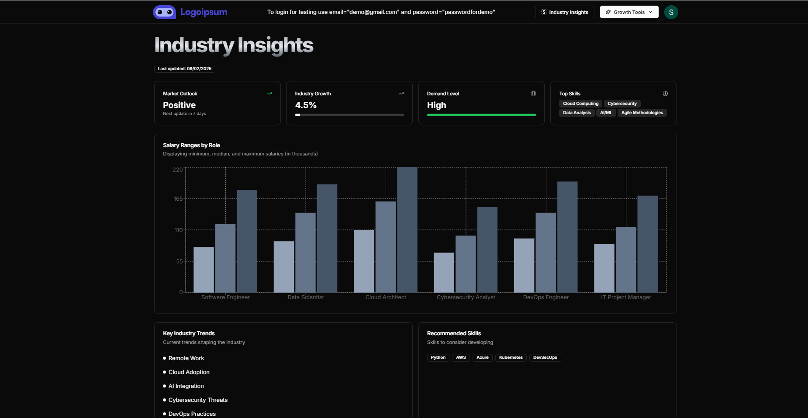

# AI Career Coach

## 🚀 Introduction

The **AI Career Coach** is a web application built with **Next.js 14** that helps users manage their professional development. It provides AI-powered tools for **resume building, cover letter generation, and interview preparation**, all powered by **Google's Gemini AI**.


## ✨ Features

- **User Authentication** with [Clerk](https://clerk.dev/)
- **AI-Powered Resume Builder** 📝
- **Cover Letter Generator** ✉️
- **Interview Preparation Tools** 🎤
- **Database Management with Prisma & PostgreSQL (Neon)**
- **Background Task Processing with Inngest** ⚡
- **Beautiful UI with Tailwind CSS & Shadcn UI** 🎨
- **Light & Dark Theme Support** 🌞🌙
- **Secure Environment Variable Handling** 🔒

## 🛠️ Tech Stack

| Technology                   | Description                                |
| ---------------------------- | ------------------------------------------ |
| **Next.js 14**               | React-based framework for SSR & API routes |
| **Clerk**                    | Authentication & user management           |
| **Google's Gemini AI**       | AI-powered content generation              |
| **PostgreSQL (Neon)**        | Database for storing user data             |
| **Prisma**                   | ORM for database management                |
| **Inngest**                  | Background job processing                  |
| **Tailwind CSS & Shadcn UI** | UI styling                                 |

## 📁 Project Structure

```
📂 ai-career-coach
 ┣ 📂 app                  # Next.js app router pages
 ┣ 📂 components           # UI components using Shadcn UI
 ┣ 📂 lib                  # Utility functions & helpers
 ┣ 📂 prisma               # Database schema & migrations
 ┣ 📂 server               # Server actions & API logic
 ┣ 📜 .env                 # Environment variables (keep secret!)
 ┣ 📜 package.json         # Dependencies & scripts
 ┗ 📜 README.md            # Project documentation
```

## 🔐 Environment Variables

Create a `.env` file in the root directory and add the following:

```env
DATABASE_URL=your_database_url
NEXT_PUBLIC_CLERK_PUBLISHABLE_KEY=your_clerk_publishable_key
CLERK_SECRET_KEY=your_clerk_secret_key
NEXT_PUBLIC_CLERK_SIGN_IN_URL=/sign-in
NEXT_PUBLIC_CLERK_SIGN_UP_URL=/sign-up
NEXT_PUBLIC_CLERK_AFTER_SIGN_IN_URL=/onboarding
NEXT_PUBLIC_CLERK_AFTER_SIGN_UP_URL=/onboarding
GEMINI_API_KEY=your_google_gemini_api_key
```

## 📦 Installation & Setup

### 1️⃣ Clone the Repository

```sh
git clone https://github.com/rapoluShruti/pathpilot.git
cd ai-career-coach
```

### 2️⃣ Install Dependencies

```sh
yarn install  # or npm install
```

### 3️⃣ Setup the Database

```sh
npx prisma generate  # Generate Prisma Client
npx prisma db push   # Push schema to Neon database
```

### 4️⃣ Start the Development Server

```sh
yarn dev  # or npm run dev
```

## 🎯 Usage Workflow

1. **User Authentication:** Users sign up via Clerk and complete onboarding.
2. **Resume Building:** Users can create and edit resumes.
3. **Cover Letter Generation:** AI generates professional cover letters.
4. **Interview Prep:** Users practice mock interviews using AI-driven questions.
5. **Task Processing:** Background tasks run via Inngest.

## 🛡️ Security & Best Practices

- **Store API keys & secrets in `.env` files.**
- **Use Prisma migrations for database updates.**
- **Restrict access using Clerk authentication.**
- **Sanitize user input to prevent XSS/SQL Injection.**

## 🤝 Contribution

Contributions are welcome! Feel free to open an issue or submit a pull request.

## 📜 License

This project is licensed under the MIT License. See the [LICENSE](LICENSE) file for details.

## 📞 Contact

- **Email:** shrutirapolu@gmail.com.com
- **GitHub:** [Your GitHub](https://github.com/rapoluShruti)

